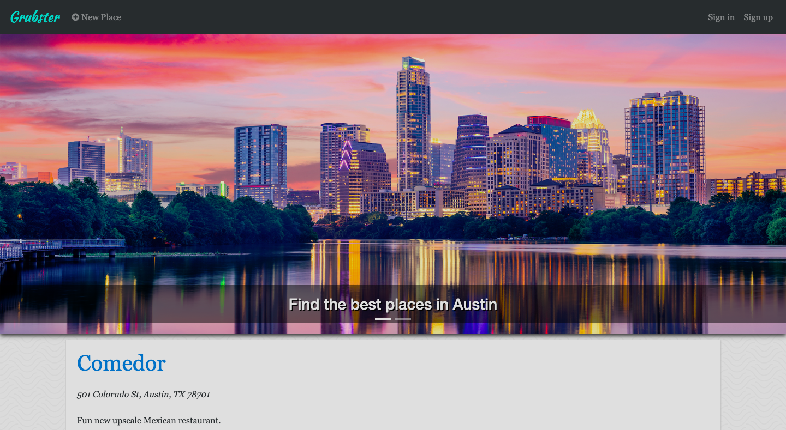
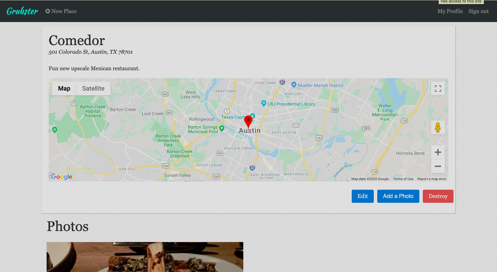
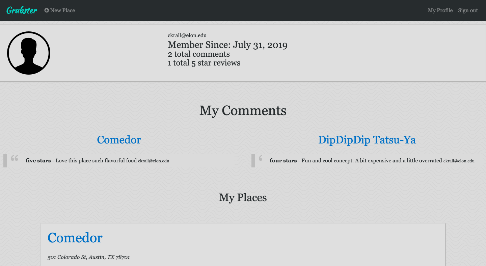

# Grubster

This is an app for people to share their favorite places to eat around town. Users can post photos and information about the places they like, while other users can rate and comment these places. There is a dashboard for users to keep track of their participation on the app.

The application was built on a Ruby on Rails framework. The information is saved to a PostgreSQL database. Devise is used for user authentication. The Geocoder API displays Google Maps when a correct street address is entered. SendGrid helps with notifying a user via email when someone else leaves a comment for the restaurant they have shared information on.

## Click [here](https://grubster-conner-krall.herokuapp.com/) to visit the website!

This is the home page:

An example of a restaurant profile:

A sample user dashboard:

## Tools & Resources

* [Ruby on Rails](https://rubyonrails.org/) 
* [PostgreSQL](https://www.postgresql.org/)
* [Bootstrap](https://getbootstrap.com/)
* [Devise](https://github.com/plataformatec/devise/)
* [Geocoder](https://github.com/alexreisner/geocoder/)
* [Google Fonts](https://fonts.google.com/)
* [SendGrid](https://devcenter.heroku.com/articles/sendgrid/)